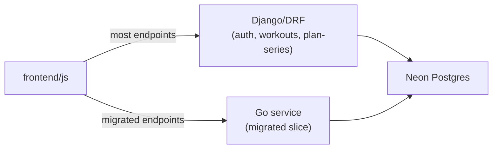

# Go migration plan (hand-implement later)

> **Intent:** learning reference for a future by-hand Go rewrite. This is **not** something to generate with AI — implement it yourself when you want the practice. Until then, the production API stays Django/DRF.

This document captures: how the app runs today (concurrency), a full DRF → Go migration roadmap, and a recommended first slice (analytics-only) that keeps project risk low while maximizing Go learning.

---

## Part 1 — How the app runs today (concurrency)

### Current process model

| Layer | What we use |
|-------|-------------|
| Views | 100% sync DRF (`APIView` / ViewSet / `@api_view`). No `async def` views. |
| Local | `python manage.py runserver` |
| Prod | Gunicorn WSGI (`backend.wsgi:application`) via Render free tier |
| Config | [`backend/gunicorn.conf.py`](../backend/gunicorn.conf.py): **1 worker process**, **4 threads**, `gthread` |
| Hosting | Single Render free instance (no autoscaling). Sleeps when idle; cron-job.org pings every 14 min. |
| DB | Neon Postgres via the pooler host (`DATABASE_URL`). `CONN_MAX_AGE` reuses connections within the process. |
| Cache | Django `LocMemCache` (in-process). Analytics use versioned keys in [`backend/core/analytics/cache_utils.py`](../backend/core/analytics/cache_utils.py). |
| Background jobs | None in-process (no Celery/Redis). dbt + DB backup run from GitHub Actions cron. |

### Why workers stay at 1

`LocMemCache` is **process-local**. Analytics invalidation bumps `analytics:v:{user_id}` in that process’s memory when workouts are written. Multiple **worker processes** would each keep their own counter → stale charts after writes on another worker.

**Threads within one process are fine** — they share memory, and `LocMemCache` is thread-safe. That is why prod uses `--workers 1 --threads 4` rather than more workers. Do not raise `--workers` without switching `CACHES` to a shared backend first (e.g. database cache or Redis).

### What “async” means here today

- Concurrent request handling comes from **gthread** (overlapping DB I/O while `psycopg2` releases the GIL), not from ASGI/`async def` views.
- Password-reset MailerSend calls are dispatched on a **background thread** so the HTTP response is not blocked on the external API.
- True ASGI + async views are out of scope until/unless the above is insufficient (see “Out of scope” below).

---

## Part 2 — Full DRF → Go migration roadmap

**Surface area (approx.):** 2 Django apps (`authentication`, `core`), ~13 models, ~19 serializers, ~40 first-party endpoints.

**Schema ownership stays as-is:** Django migrations own auth only; Alembic + dbt own `core.*`. A Go service reading Neon directly is architecturally clean — it does not fight Django migrations for the fact/dim tables.

### Suggested port order (lowest risk first)

1. **Dimension lists** — `GET /api/muscles/`, `/api/equipment/`, `/api/attachments/`, `/api/exercises/` (+ glossary actions). Simple selects; some are `cache_page`-cached today.
2. **Analytics (8 GET routes)** — `/api/v1/rest-days`, `favourite-exercises`, `total-volume`, `total-volume-daily`, `workout-splits`, `gym-weekdays`, `workout-sessions`, `home-summary`. Already raw SQL under [`backend/core/analytics/sql/`](../backend/core/analytics/sql/); cache helpers in `cache_utils.py`.
3. **Workouts CRUD** — [`backend/core/views.py`](../backend/core/views.py) `WorkoutsViewSet` + `@action`s (`next-workout-info`, `next-set-info`, `last`, `plan-batch`). Custom validation, ownership filtering, `DateForeignKey` semantics.
4. **Plan-series** — [`backend/core/plan_series_serializers.py`](../backend/core/plan_series_serializers.py) + [`backend/core/recurrence.py`](../backend/core/recurrence.py). Nested create/update/delete; highest domain complexity.
5. **Auth last (or never)** — JWT (`simplejwt`), session auth, Google OAuth (django-allauth), MailerSend password reset. Dual auth + OAuth redirects are the worst risk/reward for a learning rewrite.

### Cross-cutting Go equivalents

| Django / DRF today | Go equivalent |
|--------------------|---------------|
| `simplejwt` Bearer tokens | Verify HS256 with the same secret/claims so both stacks can accept the same access tokens during a dual-run |
| `filter(user=request.user)` | `WHERE user_id = $1` on every query |
| `EndpointThrottle` / `DefaultThrottle` | Token-bucket middleware per user+route |
| `WorkoutPagination` (50 / max 200) | Explicit `LIMIT` / `OFFSET` |
| LocMem + versioned analytics keys | In-memory TTL map with the same key scheme (or Redis if you already need shared cache) |
| drf-yasg Swagger | Optional OpenAPI (`swaggo` or hand-maintained) |

---

## Part 3 — Recommended first hand-built slice: analytics-only Go service

Build a **separate** Go service that owns only the 8 analytics GETs. Leave Django for everything else.

### Why this slice

- **Read-only** — wrong chart numbers are recoverable; no write-path corruption.
- **Already raw SQL** — port [`backend/core/analytics/sql/`](../backend/core/analytics/sql/) nearly verbatim into `pgx`.
- **Self-contained cache** — reimplement TTL + `analytics:v:{user_id}` invalidation; good goroutine / `sync.RWMutex` practice.
- **Auth is just JWT verify** — no allauth/Google/MailerSend in this service.
- **Tiny frontend blast radius** — analytics fetchers live in [`frontend/js/core/charts/data-fetch.js`](../frontend/js/core/charts/data-fetch.js); add a second base URL (or flag) there only.
- **Easy rollback** — point `data-fetch.js` back at Django; no schema migration.

### Hand-implementation checklist

1. `go mod init`, router (`chi` or stdlib `net/http`), `pgx/v5`.
2. JWT middleware: `Authorization: Bearer`, HS256, same secret/claims as `simplejwt`, extract user id.
3. One Go query function per SQL file under `backend/core/analytics/sql/`; keep SQL close to the original for easy parity diffs.
4. In-memory cache matching `cache_utils.py` (10 min TTL, version bump keys).
5. Parity checks: same user + date range against Django vs Go; diff JSON before cutover.
6. Deploy a second free-tier service pointed at the same Neon `DATABASE_URL`; share the JWT signing secret as an env var.
7. Repoint only the analytics calls in `data-fetch.js` to the Go host; keep Django analytics routes live during burn-in.
8. After burn-in, retire or keep Django analytics as a documented fallback.

### If it goes well

Next learning slices, increasing risk: dimensions → workouts CRUD → plan-series / auth only if you want the full roadmap.

---

## Out of scope (for both Go and “make Django async”)

- Generating the Go service with AI (defeats the learning goal).
- Switching the whole API to ASGI + `async def` views unless gthread + background email + `CONN_MAX_AGE` prove insufficient. Async ORM does not make `psycopg2` non-blocking by itself; the main win would be fan-out (`asyncio.gather`) on multi-query endpoints like `home-summary`, at the cost of a larger serving-stack change (sessions, allauth, WhiteNoise, Render start command).
- Raising gunicorn `--workers` above 1 without a shared cache backend.
